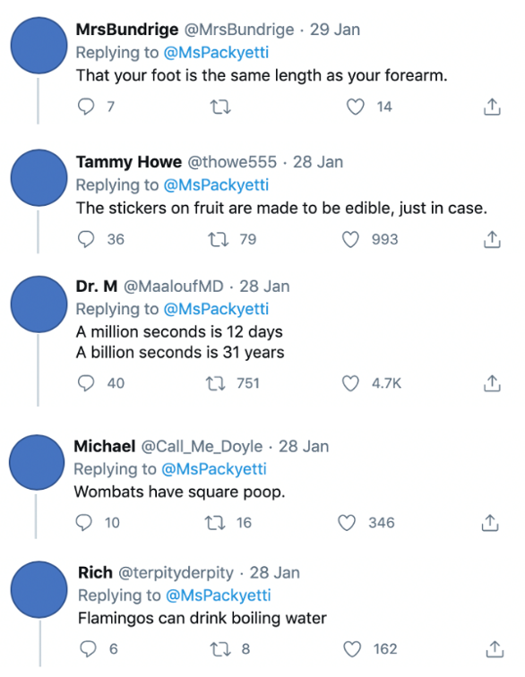

The communication of ideas is essential. Whether building on terms previously heard, discussing ideas with peers, or labelling experiences, language plays a vital role in understanding new concepts. Kaplan, et al. (2009) suggest that statistical words with everyday counterparts can endorse incorrect assumptions about statistical concepts. For example, the following is a Tweet calling for “random” facts:

<blockquote class="twitter-tweet" align = center>
What’s the most random fact you know?  I mean RANDOM random.
&mdash; brittany packnett cunningham ain’t here for real. (@MsPackyetti) <a href="https://twitter.com/MsPackyetti/status/1221992423905202176?ref_src=twsrc%5Etfw">January 28, 2020</a></blockquote> 

Some of the more interesting replies include:

 

See some discussion <a href = https://vimeo.com/555571695 target = "_blank">examples</a>!

The use of “random” here refers to something being unusual or surprising. With this in mind, it is then understandable that someone might deem a patterned sequence of heads and tails as being not random – HTHTH appears to be neither unusual nor surprising. The term random is homonymous – it holds more than one meaning or definition or use (Kaplan et al., 2009). There are a few cases of this in statistics (as well as other fields, too); average, margin, mean, and normal are some examples.

 
