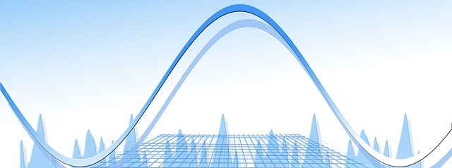

# {.tabset}
## 2.1 Problem
<p style="text-align: center;" !important>Well, what about randomness and distributions? Is randomness even relevant to distributions?</p>

```{r, echo=FALSE, fig.align = 'center'}

```

Yes! Randomness is fundamental for numerous other concepts, such as independence, variability, sampling, random variables, *distributions*, random walks, re-randomisation, and much more (see Batanero et al, 2016; New Zealand Ministry of Education, 2012).

The connection between random phenomena and structured distributions appears to be rarely taught but is essential to how everyday events can be expressed statistically. This is just one example of how randomness misconceptions could affect understanding in other areas in statistics.

<h3>Learning Aims:</h3>
<ol><li>Consider how random events might be expressed over an area using knowledge of distributions.</li>
<li>Explore the relationship between small samples, large samples, and distributions.</li>
<li>Consider how randomness can effect waiting times and build into different distributions.</li>
<li>Recognise the process of random sampling from distributions.</li></ol>
<br>

## 2.2 Spatial Randomness {.tabset .tabset-pills}
### Introduction
<p>Spatial randomness differs slightly from the typical sequence-based examples we usually see. This is where we consider random events over an area.</p>
<p>For this section, we're going to be exploring spatial randomness with raindrops. Imagine, you are watching the rain as it falls on the pavestones outside. The pavestones make a 20 by 20 grid, comprising 400 squares.</p>
<p style="background-image: url('boat.jpg'); ; background-repeat: no-repeat; background-attachment: fixed;
  background-size: cover; color: white ! important; text-align: center ! important;">
<br>
<br>
<br>
</p>
<body>
<ul><li>Discussion time! Before moving on, talk in pairs or groups about what 50 raindrops on the pavestones might look like if they left a mark. What assumptions might you make?</li>
<li>When you have discussed what this might look like, consider how you might go about simulating this... Hint: what kind of distribution might you use?</li></ul>
</body>

<p>See some discussion examples on <a href = https://vimeo.com/557055087 target = "_blank">rainfall</a> (uanga) and <a href = https://vimeo.com/555572366 target = "_blank">glow-worms</a> (pūrātoke)!</p>

<p style="background-image: url('fern.jpg'); ; background-repeat: no-repeat; background-attachment: fixed;
  background-size: cover; color: white ! important; text-align: center ! important;"><b>Whānau Time!</b><br>In this sub-section, <em>Spatial Randomness</em>, we are learning about how randomness can be seen over an area.<br>Ask your whānau about their experiences with seeing random phenomenon, like rainfall and glow-worms, and any stories relating to this.</p>

<br>

### Simulating Rainfall
<p>Let's have a bit more of an explore. Using the plot below, change the kind of distribution used in the simulation to produce a spatial plot. This plot represents the pavestones, with the dots recording where each of the 50 raindrops fall.</p>
<body>
    <ul><li>For each plot, discuss what assumptions you might make about the way the rain is falling. Some of the distributions might not be appropriate to use for this example, which ones do you think that might be?</li></ul>
</body>

<table width="100%">
<tr>
<td align="left" valign="top" width="50%">
<center><iframe src="https://player.vimeo.com/video/551328643" width="340" height="284" frameborder="0" allow="fullscreen" allowfullscreen></iframe></center> 
</td>
<td align="left" valign="top" width="50%">
<center><iframe src="https://player.vimeo.com/video/551328973" width="340" height="284" frameborder="0" allow="fullscreen" allowfullscreen></iframe></center>
</td>
</tr>
<tr>
<td align="left" valign="top" width="50%">
<center><iframe src="https://player.vimeo.com/video/551329196" width="340" height="284" frameborder="0" allow="fullscreen" allowfullscreen></iframe></center>
</td>
<td align="left" valign="top" width="50%">
<center><iframe src="https://player.vimeo.com/video/551329099" width="340" height="284" frameborder="0" allow="fullscreen" allowfullscreen></iframe></center>
</td
</tr>
</table>

<body>
<ul><li>Which distribution do you think worked best?</li></ul>
</body>
More information on these distributions <a href = ".\FurtherExplanations.html" target = "_blank">here</a>.

<br>

### Short-run & Long-run
<p>Our next exploration will look at some examples of short run and long run simulations.</p>
<body>
    <ul><li>Before you play with the slider, which distribution do you think this might be?</li></ul>
</body>
<p>Drag the slider to change the number of observations.</p>

```{r echo = FALSE, message = FALSE, warning = FALSE}
library(plotly)
# create data
aval <- list()
for(step in 1:8){
  aval[[step]] <-list(visible = FALSE,
                      name = paste0('v = ', step),
                      x = runif(3^step, 0, 20),
                      y = runif(3^step, 0, 20))
}
aval[3][[1]]$visible = TRUE

# create steps and plot all traces
m <- list(
  l = 220,
  r = 50,
  b = 50,
  t = 10,
  pad = 4
)
steps <- list()
fig <- plot_ly(width = 700, height = 400) 
fig <- fig %>%
  layout(margin = m,
        xaxis = list(title = "x", range = c(0, 21)),
        yaxis = list(title = "y", range = c(0, 21)))
for (i in 1:8) {
 fig <- add_markers(fig, x = aval[i][[1]]$x,  y = aval[i][[1]]$y, visible = aval[i][[1]]$visible, 
                 name = aval[i][[1]]$name, type = 'scatter', 
                 mode = 'markers', showlegend = FALSE)

  step <- list(args = list('visible', rep(FALSE, length(aval))),
               method = 'restyle')
  step$args[[2]][i] = TRUE  
  steps[[i]] = step 
}  

# add slider control to plot

fig <- fig %>%
  layout(sliders = list(list(active = 2,
                  currentvalue = list(prefix = "Frequency: "),
                  pad = list(t = 60),
                  steps = steps)))
fig
```
<body>
<ul><li>Was your distribution prediction correct?</li></ul>
</body>
<p>See some discussion <a href = https://vimeo.com/557054971 target = "_blank">examples</a> on short run and long run simulations!</p>
<br>

## 2.3 Waiting Times {.tabset .tabset-pills}
### Introduction
<p>Waiting times are another example where we can consider randomness.</p>

<p>For this section, we're going to be exploring waiting times using tweets. Imagine, you're procrastinating, scrolling on Twitter, waiting for updates from celebrities.</p>

<ul><li>Discussion time! Before moving on, talk in pairs or groups about how often you think a celebrity (any celebrity you like) might post a tweet. The explore some examples from the six celebs below.</li></ul>

```{r echo = FALSE, message = FALSE, warning = FALSE}
library(rtweet)
library(RColorBrewer)
```

```{r echo = FALSE, message = FALSE, warning = FALSE}
y = c(rep(0.5, 16))
df <- data.frame(
  Trump = c(0, 1, 13, 20, 48, 213, 491, 492, 530, 657, 658, 702, 948, NA, NA, NA),
  Kim_Kardashian = c(0, 128, 598, 605, 642, 676, 680, 741, 741, 756, 790, 905, 943, 1047, 1056, 1206),
  Lady_Gaga = c(0, 15, 31, 37, 62, 79, 106, 132, 404, 1328, 1330, 1332, 1333, NA, NA, NA),
  The_Rock = c(0, 5, 74, 87, 151, 818, 819, 821, 829, 832, 861, 863, 1134, NA, NA, NA),
  Obama = c(0, 7, 121, 753, 850, 921, 999, 1020, 1038, 1151, 1217, 1261, NA, NA, NA, NA),
  RuPaul = c(0, 1, 4, 25, 26, 787, 833, 923, 924, 926, 932, 944, 960, 961, NA, NA), 
  y = y)

m <- list(
  l = 250,
  r = 50,
  b = 50,
  t = 10,
  pad = 5
)

ax <- list(
  title = "",
  showline = FALSE,
  showticklabels = FALSE)

fig <- plot_ly(df, y = ~y, showlegend = FALSE, 
               width = 970, height = 250)
fig <- fig %>% add_markers(x = ~Trump, name = "Trump")
fig <- fig %>% add_markers(x = ~Kim_Kardashian, name = "Kim Kardashian", visible = F)
fig <- fig %>% add_markers(x = ~Lady_Gaga, name = "Lady Gaga", visible = F)
fig <- fig %>% add_markers(x = ~The_Rock, name = "Dwayne \"The Rock\" Johnson", visible = F)
fig <- fig %>% add_markers(x = ~Obama, name = "Obama", visible = F)
fig <- fig %>% add_markers(x = ~RuPaul, name = "RuPaul", visible = F)
fig <- fig %>% layout(margin = m,
        yaxis = ax,
        xaxis = list(title = 'Sequential Tweets'),
    updatemenus = list(
      list(
        pad = list('r'= 0, 't'= 10, 'b' = 200),
        x = -0.05,
        y = 1.27, 
        buttons = list(
          list(method = "restyle",
               args = list("visible", list(TRUE, FALSE, FALSE, FALSE, FALSE, FALSE)),
               label = "Donald Trump - 01 May, 2020"),
          
          list(method = "restyle",
               args = list("visible", list(FALSE, TRUE, FALSE, FALSE, FALSE, FALSE)),
               label = "Kim Kardashian - 15 October, 2020"),
          
          list(method = "restyle",
               args = list("visible", list(FALSE, FALSE, TRUE, FALSE, FALSE, FALSE)),
               label = "Lady Gaga - 17 January, 2021"),
          
          list(method = "restyle",
               args = list("visible", list(FALSE, FALSE, FALSE, TRUE, FALSE, FALSE)),
               label = "Dwayne \"The Rock\" Johnson - 16 February, 2021"),
         
           list(method = "restyle",
               args = list("visible", list(FALSE, FALSE, FALSE, FALSE, TRUE, FALSE)),
               label = "Barack Obama - 08 January, 2016"),

          list(method = "restyle",
               args = list("visible", list(FALSE, FALSE, FALSE, FALSE, FALSE, TRUE)),
               label = "RuPaul - 10 December, 2020")))
    )
  )

fig
```

<body>
    <ul><li>Discussion time! Not all tweets will be random - sometimes celebrities or companies have timed releases of updates. This might be seen by times that are regular; for example, every six hours. With exception to this, discuss whether you think the time when tweets are posted are random or not.</li></ul>
<p>This is also an interesting analysis: <a href = http://varianceexplained.org/r/trump-tweets/ target="_blank">Trump Tweets: Android vs. Apple </a></p>
</body>

See some <a href = https://vimeo.com/557055270 target = "_blank">examples</a> on the randomness of tweets!

<p style="background-image: url('fern.jpg'); ; background-repeat: no-repeat; background-attachment: fixed;
  background-size: cover; color: white ! important; text-align: center ! important;"><b>Whānau Time!</b><br>In this sub-section, <em>Waiting Times</em>, we are learning about how randomness can be seen over time. The context here will reference Twitter, but there are many examples of random waiting times.<br>Ask your whānau about their experiences and stories about random times between events, like out fishing, natural disasters, and weather patterns.</p>

<br>

### Exploring with Scampy
To explore the waiting times distribution and distribution of counts, get the data for your favourite celebrity in the example above using the buttons below and have a play around on <a href = "https://www.stat.auckland.ac.nz/~wild/scampy/" target="_blank">Scampy</a>.

This is a tool developed at the University of Auckland by the Department of Statistics. It actually started my PhD! My honours dissertation piloted this tool and from that research, my PhD thesis grew!

I recommend having an explore of the data on Scampy and then coming back here to explore the randomness going on in the example.

See a discussion <a href = https://vimeo.com/555569747 target = "_blank">example</a> using Scampy!

```{r setup, include=FALSE}
knitr::opts_chunk$set(echo = FALSE)
```

```{r echo = FALSE, fig.align="center", message = FALSE, warning = FALSE}
library(htmltools)

shiny::actionButton("data_button_Trump", 
                    label = "Donald Trump",
                    class = "list-item-b",
                    onclick = "button_handler_Trump()")
div(id = "trumpContainer", 
    hidden = "true",
    HTML("Waiting Times =", paste(df[c(1:13), 1], collapse = ", ")))

shiny::actionButton("data_button_KimK", 
                    label = "Kim Kardashian", 
                    class = "list-item",
                    onclick = "button_handler_Kim()")
div(id = "kimContainer", 
    hidden = "true",
    HTML("Waiting Times =", paste(df[c(1:16), 2], collapse = ", ")))

shiny::actionButton("data_button_Gaga", 
                    label = "Lady Gaga", 
                    class = "list-item",
                    onclick = "button_handler_Gaga()")
div(id = "gagaContainer", 
    hidden = "true",
    HTML("Waiting Times =", paste(df[c(1:13), 3], collapse = ", ")))

shiny::actionButton("data_button_Rock", 
                    label = "The Rock", 
                    class = "list-item",
                    onclick = "button_handler_Rock()")
div(id = "rockContainer", 
    hidden = "true",
    HTML("Waiting Times =", paste(df[c(1:13), 4], collapse = ", ")))

shiny::actionButton("data_button_Obama", 
                    label = "Barack Obama", 
                    class = "list-item",
                    onclick = "button_handler_Obama()")
div(id = "obamaContainer", 
    hidden = "true",
    HTML("Waiting Times =", paste(df[c(1:12), 5], collapse = ", ")))

shiny::actionButton("data_button_Ru", 
                    label = "RuPaul", 
                    class = "list-item",
                    onclick = "button_handler_Ru()")
div(id = "ruContainer", 
    hidden = "true",
    HTML("Waiting Times =", paste(df[c(1:13), 6], collapse = ", ")))
```

```{js}

function button_handler_Trump() {
  var x = document.getElementById("trumpContainer");
  if (x.style.display === "none") {
    x.style.display = "block";
  } else {
    x.style.display = "none";
  }
  x.style.alignContent = "center";
  x.style.color = "gray";
  x.style.fontFamily = "Gill Sans";
}
function button_handler_Kim() {
  var x = document.getElementById("kimContainer");
  if (x.style.display === "none") {
    x.style.display = "block";
  } else {
    x.style.display = "none";
  }
  x.style.alignContent = "center";
  x.style.color = "gray";
  x.style.fontFamily = "Gill Sans";
}
function button_handler_Gaga() {
  var x = document.getElementById("gagaContainer");
  if (x.style.display === "none") {
    x.style.display = "block";
  } else {
    x.style.display = "none";
  }
  x.style.alignContent = "center";
  x.style.color = "gray";
  x.style.fontFamily = "Gill Sans";
}
function button_handler_Rock() {
  var x = document.getElementById("rockContainer");
  if (x.style.display === "none") {
    x.style.display = "block";
  } else {
    x.style.display = "none";
  }
  x.style.alignContent = "center";
  x.style.color = "gray";
  x.style.fontFamily = "Gill Sans";
}
function button_handler_Obama() {
  var x = document.getElementById("obamaContainer");
  if (x.style.display === "none") {
    x.style.display = "block";
  } else {
    x.style.display = "none";
  }
  x.style.alignContent = "center";
  x.style.color = "gray";
  x.style.fontFamily = "Gill Sans";
}
function button_handler_Ru() {
  var x = document.getElementById("ruContainer");
  if (x.style.display === "none") {
    x.style.display = "block";
  } else {
    x.style.display = "none";
  }
  x.style.alignContent = "center";
  x.style.color = "gray";
  x.style.fontFamily = "Gill Sans";
}
```

<br>

### Waiting Times to Distributions
When we have enough data, random observations typically build into distribution. It takes a few tweets to get there though!

In May, 2020, \@TheRealDonaldTrump tweeted 549 times! Suppose you only get notifications when a tweet by \@TheRealDonaldTrump is made then, on 1st of May, 2020, your phone would buzz 13 times. If we speed this up, it would sound like this:

<center><div style="padding:75% 0 0 0;position:relative;"><iframe src="https://player.vimeo.com/video/554144838?badge=0&amp;autopause=0&amp;player_id=0&amp;app_id=58479" frameborder="0" allow="autoplay; fullscreen; picture-in-picture" allowfullscreen style="position:absolute;top:0;left:0;width:100%;height:100%;" title="The Sound of Trump Tweeting"></iframe></div><script src="https://player.vimeo.com/api/player.js"></script></center>

We are interested in the time between the tweets (the lines between tweets shown in the video). If we plot the time between each tweet, we get the following plot. Use the scale to add more observations to the graph.

```{r echo = FALSE, message = FALSE, warning = FALSE}
# create data
dataTrump = c(0.00, 0.02, 0.20, 0.10, 0.45, 2.75, 4.63, 0.00, 0.63, 2.12, 0.02, 0.72, 4.08, 9.40, 0.17, 1.05, 2.58, 0.08, 3.05, 0.50, 0.22, 0.30, 0.12, 0.15, 0.17, 0.27, 0.57, 0.10, 0.47, 0.07, 4.42, 8.18, 0.25, 0.37, 0.43, 0.03, 0.03, 0.02, 0.02, 0.02, 0.03, 1.50, 0.08, 0.12, 3.43, 2.13, 0.00, 0.37, 1.45, 3.97, 0.60, 7.92, 1.68, 0.20, 1.07, 0.08, 0.68, 8.17, 0.00, 4.17, 2.00, 0.00, 0.00, 0.00, 7.77, 0.03, 0.05, 0.55, 3.63, 0.05, 0.67, 0.70, 0.32, 0.20, 0.02, 0.55, 1.00, 1.67, 1.93, 3.32, 9.72, 0.00, 0.00, 0.00, 2.17, 5.40, 19.73, 1.02, 0.00, 1.15, 0.88, 4.42, 11.25, 0.10, 0.18, 5.47, 0.00, 0.07, 3.22, 0.03, 1.53, 0.00, 0.00, 17.90, 0.12, 0.27, 0.13, 0.17, 1.65, 0.72, 0.25, 0.12, 1.02, 0.00, 0.00, 7.45, 0.00, 0.00, 0.00, 0.27, 7.03, 0.65, 0.00, 0.03, 0.02, 0.02, 0.02, 0.23, 0.07, 2.48, 0.18, 2.23, 0.53, 0.02, 0.17, 1.33, 0.10, 4.12, 2.67, 0.07, 0.50, 10.35, 0.23, 0.17, 0.27, 0.12, 0.07, 0.32, 0.15, 0.03, 0.88, 0.07, 0.10, 2.07, 1.53, 0.00, 0.00, 3.03, 0.00, 0.03, 4.10, 0.18, 0.12, 0.92, 6.70, 0.02, 0.12, 0.02, 0.00, 0.02, 0.03, 0.13, 0.18, 0.10, 0.22, 0.10, 0.08, 0.02, 0.07, 0.05, 0.15, 0.18, 0.52, 0.03, 0.93, 0.20, 0.20, 12.85, 0.40, 0.08, 0.32, 9.40, 0.27, 0.18, 0.03, 0.80, 0.27, 1.10, 9.22, 0.03, 0.02, 0.00, 11.22, 0.43, 0.10, 0.38, 1.22, 0.88, 0.42, 1.50, 0.23, 0.18, 6.05, 2.53, 0.02, 0.53, 0.82, 0.22, 0.02, 8.45, 0.00, 2.17, 0.08, 3.87, 0.37, 0.32, 2.95, 3.43, 1.98, 0.75, 0.05, 0.10, 6.02, 0.08, 1.68, 0.52, 0.08, 0.22, 0.33, 0.03, 1.05, 0.05, 0.30, 0.05, 0.10, 0.37, 0.07, 0.25, 3.55, 0.52, 0.28, 2.28, 0.02, 0.42, 0.00, 6.00, 7.23, 0.35, 0.00, 1.45, 0.23, 5.05, 0.15, 0.32, 1.27, 0.10, 0.08, 0.70, 0.93, 0.08, 0.02, 0.08, 0.02, 1.47, 0.15, 0.00, 0.23, 1.17, 0.00, 0.00, 10.12, 0.02, 0.02, 0.02, 0.03, 0.00, 0.10, 0.00, 0.13, 1.87, 0.00, 0.03, 0.03, 0.02, 0.15, 0.10, 7.63, 1.02, 0.55, 0.08, 0.08, 0.12, 1.43, 0.92, 10.57, 2.87, 0.05, 0.00, 0.17, 0.20, 2.02, 7.67, 1.00, 0.42, 0.20, 0.03, 0.18, 0.13, 0.07, 0.27, 7.42, 0.00, 0.27, 0.58, 1.20, 0.08, 0.10, 0.00, 0.10, 0.00, 0.45, 0.00, 3.03, 0.35, 0.00, 5.63, 0.00, 1.38, 0.00, 0.00, 2.85, 13.00, 1.00, 0.00, 0.22, 3.72, 0.02, 0.10, 0.12, 0.00, 1.55, 0.82, 0.32, 0.18, 0.67, 0.23, 0.17, 0.03, 0.50, 0.10, 1.17, 0.70, 9.42, 0.08, 5.03, 0.58, 2.12, 0.02, 0.12, 0.13, 0.00, 0.40, 0.02, 0.00, 0.00, 0.02, 0.18, 0.10, 0.03, 0.00, 0.00, 0.02, 0.22, 0.00, 0.02, 0.05, 12.37, 0.05, 0.02, 0.03, 0.05, 0.32, 0.05, 0.03, 9.97, 0.00, 0.05, 0.02, 0.85, 0.25, 2.32, 0.10, 0.12, 0.53, 10.13, 0.13, 0.63, 0.23, 0.10, 0.02, 2.73, 2.92, 2.67, 1.32, 0.22, 0.08, 0.12, 1.12, 0.00, 0.18, 0.25, 0.03, 0.42, 0.42, 0.00, 9.08, 0.00, 0.00, 0.00, 0.07, 0.03, 0.77, 0.08, 0.35, 0.00, 0.00, 3.45, 3.02, 0.08, 0.17, 3.77, 12.05, 0.20, 0.00, 0.12, 0.90, 0.00, 0.43, 1.25, 0.27, 0.00, 0.50, 3.80, 0.00, 3.72, 0.30, 0.00, 2.60, 0.23, 0.18, 1.18, 7.28, 0.00, 0.15, 0.17, 0.12, 0.25, 0.07, 0.72, 0.62, 1.03, 3.77, 3.32, 0.80, 0.38, 0.00, 0.30, 0.72, 0.17, 1.73, 0.50, 1.62, 0.25, 7.87, 0.07, 0.03, 0.15, 0.10, 0.35, 1.00, 0.93, 0.17, 1.58, 0.38, 4.40, 0.00, 0.55, 0.00, 0.52, 0.00, 0.00, 0.00, 0.00, 0.00, 0.00, 0.00, 0.50, 1.27, 0.47, 0.23, 0.18, 3.87, 0.00, 6.28, 1.38, 0.18, 0.28, 1.75, 0.47, 3.07, 0.00, 1.43, 7.57, 9.33, 0.00, 0.00, 0.00, 0.87, 0.43, 0.40, 1.48, 1.15, 1.27, 0.22, 0.00, 0.03, 5.72, 0.55, 1.23, 0.05, 13.85, 0.15, 0.18, 0.20, 3.47, 0.18, 1.88, 0.72, 1.28)
aval2 <- list()
aval2[[1]] <-list(visible = FALSE,
                      name = c("n = 13"),
                      x = dataTrump[1:13])
aval2[[2]] <-list(visible = FALSE,
                      name = c("n = 30"),
                      x = dataTrump[1:30])
aval2[[3]] <-list(visible = FALSE,
                      name = c("n = 50"),
                      x = dataTrump[1:50])
aval2[[4]] <-list(visible = FALSE,
                      name = c("n = 100"),
                      x = dataTrump[1:100])
aval2[[5]] <-list(visible = FALSE,
                      name = c("n = 250"),
                      x = dataTrump[1:250])
aval2[[6]] <-list(visible = FALSE,
                      name = c("n = 549"),
                      x = dataTrump)

aval2[3][[1]]$visible = TRUE

# create steps and plot all traces
steps <- list()
fig <- plot_ly(nbinsx = 20) 
fig <- fig %>%
  layout(margin = m,
        xaxis = list(title = "Time (Hours) between Tweets by @TheRealDonaldTrump", range = c(0, 24)),
        yaxis=list(type='linear'))
for (i in 1:6) {
 fig <- add_histogram(fig, x = aval2[i][[1]]$x, 
                  visible = aval2[i][[1]]$visible, 
                  name = aval2[i][[1]]$name, type = 'histogram', 
                  showlegend = FALSE,
                  marker = list(color = 'rgb(255, 195, 0)'))

  step <- list(args = list('visible', rep(FALSE, length(aval2))),
               method = 'restyle', label = aval2[i][[1]]$name)
  step$args[[2]][i] = TRUE  
  steps[[i]] = step 
}  

# add slider control to plot

fig <- fig %>%
  layout(sliders = list(list(active = 2,
                  currentvalue = list(prefix = "Sample Size: "),
                  pad = list(t = 60),
                  steps = steps)))
fig
```

<body>
    <ul><li>Discussion time! What did you notice? What kind of distribution might \@TheRealDonaldTrump's tweets follow?</li></ul>
</body>

See a discussion <a href = https://vimeo.com/555571356 target = "_blank">example</a> on this data! Then, let's test some possible distributions. To do this, we're going to use Anna's <a href = "https://www.stat.auckland.ac.nz/~fergusson/prob_dist_explorer/fit" target="_blank">Goodness-of-Fit tool</a>. Click the button below to show the data and then paste this into the sample data box in the tool.

```{r echo = FALSE, message = FALSE, warning = FALSE}
library(htmltools)

shiny::actionButton("data_button_Trump2", 
                    label = "Donald Trump Data",
                  onclick = "button_handler_Trump2()",
                    class = "list-item")
div(id = "trumpContainer2", 
    hidden = "true",
    HTML("Waiting Times =", paste(dataTrump, collapse = ", ")))
```

```{js}

function button_handler_Trump2() {
  var x = document.getElementById("trumpContainer2");
  if (x.style.display === "none") {
    x.style.display = "block";
  } else {
    x.style.display = "none";
  }
  x.style.alignContent = "center";
  x.style.color = "gray";
  x.style.fontFamily = "Gill Sans";
}
```
<body>
    <ul><li>Which distribution fit \@TheRealDonaldTrump's tweets best?</li></ul>
</body>

<p>How about this one?</p>

<center><div style="padding:75% 0 0 0;position:relative;"><iframe src="https://player.vimeo.com/video/554101162?badge=0&amp;autopause=0&amp;player_id=0&amp;app_id=58479" frameborder="0" allow="autoplay; fullscreen; picture-in-picture" allowfullscreen style="position:absolute;top:0;left:0;width:100%;height:100%;" title="ezgif.com-gif-maker (1).mp4"></iframe></div><script src="https://player.vimeo.com/api/player.js"></script></center>

<body>
    <ul><li>What do you think? Does this fit better?</li></ul>
</body>

See a discussion <a href = https://vimeo.com/555570311 target = "_blank">example</a>!

<br>

### Getting a Random Sample
Now that we have looked at building distributions from random observations, we now want to explore the reverse process - getting a random sample from a distribution!

<p>We will continue using the \@TheRealDonaldTrump tweets.</p>
<center>
<iframe id="interactApp60c2fae37285f10017d1394b" width="800" height="800" style="border:none;max-width:100%;margin:0;" allowTransparency="true" frameborder="0" src="https://quiz.tryinteract.com/#/60c2fae37285f10017d1394b/q/1?method=iframe"></iframe>
</center>
<p>For our sample, we want the probability of selecting any given observation to remain constant. To do this, we will sample with replacement, which means we put any observations we draw back in the pile for the chance to be drawn again. The following code will give us five random observations with replacement from the \@TheRealDonaldTrump waiting time data.</p>

```{r}
sample(dataTrump, size = 5, replace = TRUE)
```

<p>Let's see an example of sampling 5 random observations:</p>
<center><div style="padding:75% 0 0 0;position:relative;"><iframe src="https://player.vimeo.com/video/554997232?badge=0&amp;autopause=0&amp;player_id=0&amp;app_id=58479" frameborder="0" allow="autoplay; fullscreen; picture-in-picture" allowfullscreen style="position:absolute;top:0;left:0;width:100%;height:100%;" title="Data Bucket Sampling"></iframe></div><script src="https://player.vimeo.com/api/player.js"></script></center>
